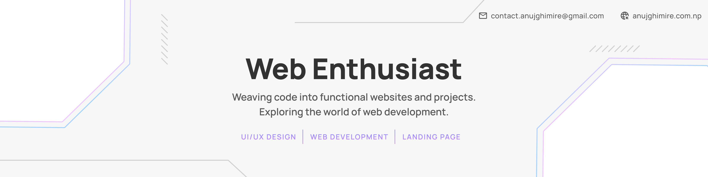

<!-- Header Banner -->

  

<!-- ## 👨‍💻 About Me

I’m a <strong>Web & Coding Enthusiast</strong> passionate about building responsive, user-focused web applications with clean and maintainable code.

<ul>
<li>🌐 Focused on <strong>Modern Web Development</strong></li>
<li>⚛️ Currently learning advanced <strong>React & frontend architecture</strong></li>
<li>📦 Building scalable <strong>UI components & real-world projects</strong></li>
<li>🎯 Improving <strong>problem-solving skills and code quality</strong></li>
<li>💡 Driven by <strong>consistency, creativity, and continuous learning</strong></li>
</ul>

--- -->

## 🛠 Tech Stack

  

---

## 📊 GitHub Stats

  

  
  

<!--## 🔗 Connect With Me

 

  &nbsp;&nbsp;
  &nbsp;&nbsp;
  &nbsp;&nbsp;
  

-->
